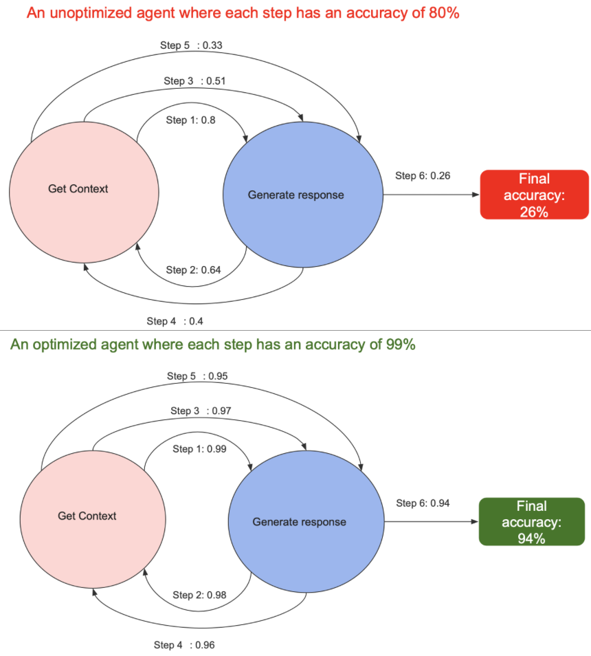

**The bitter lesson of agent optimization**

*January 2025*

Creating a demo for Retrieval Augmented Generation (RAG) or agentic workflows is easy, but building a production-grade app is 10x harder, if not more. For every blog and tutorial claiming to get you started with RAG apps or agents in less than an hour, there are hundreds more talking about the complexity of building LLM, RAG, and AI systems that operate reliably at an acceptable accuracy and latency while staying within budget. 

We don’t have to go far to see examples of this. OpenAI, [on their Devday](https://www.youtube.com/watch?v=ahnGLM-RC1Y), no less, pointed towards the iterative nature of RAG optimization. While building a RAG pipeline for an enterprise client, OpenAI observed a baseline accuracy of 45%. The OpenAI engineers then tried multiple approaches to improve accuracy including trying Hypothetical Document Embeddings, Fine-Tuning Embeddings, and experimenting with different chunk sizes to better capture relevant information. After approximately 20 iterations, they had only reached 65% accuracy. At this point, they faced the decision to either abandon the project or continue optimizing. They chose to continue, applying cross-encoders to re-rank search results, using metadata to improve context relevance, doing further Prompt Engineering, integrating a tool (SQL database), and using Query Expansion. Eventually, by trying all these methods, and persisting with the ones that pushed the accuracy upward they managed to reach 98% accuracy. 

There is [a (bitter?) lesson](https://web.archive.org/web/20241209013151/http://www.incompleteideas.net/IncIdeas/BitterLesson.html) here: great gains can be made simply by depending on search and learning. We have seen this situation play out elsewhere as well. Only the names change. Nvidia released a [paper in July 2024](https://arxiv.org/html/2407.07858v1) with the title “FACTS About Building Retrieval Augmented Generation-based Chatbots”. I will not bore you with the details, but Nvidia mentioned that they identified 15 different control points in a RAG pipeline and each one of these control points impacts the quality of the results generated. They found that, among other parameters, choosing the right query rewriting strategy, chunk size, pre-processing technique, metadata enrichment, reranking, and LLM all mattered to the final performance. The retrieval relevance determined the accuracy of the LLM response. And retrieval relevance itself was dependent on metadata enrichment, chunking and query rephrasal. Again, Nvidia used a grid-search based approach to identify the parameter settings that resulted in the highest RAG accuracy. 

You might think that leveraging search to find optimal parameters is limited to RAG and that this does not apply to agentic workflows. In fact, with agents, the gap between a hacked demo and a reliable production grade is wider. As [Richard Socher pointed out](https://x.com/RichardSocher/status/1826678227936707063), *if each step of an AI agent is 95% accurate. None of the 30 step work flows will work. Going from 95-> 99.9 is a similar last mile problem as with self driving cars*. 

There has already been [quite a bit written](https://www.kaggle.com/whitepaper-agents) about [agents](https://huyenchip.com/2025/01/07/agents.html). For our purpose, an agent is a model (e.g. LLM) that is able to call external tools.  Multi-agents are multiple agents with access to multiple external tools (which may or may not be shared across agents). Given a user prompt, an agent uses an LLM to take actions such as calling a tool, and collects observations in a loop until a goal is met.

To accurately give a response to a user prompt, the agent must be able to do two things: 

1. Retrieve precise and accurate context needed to answer the user’s query (retrieval) 
    
2. Generate the correct response given that context (generation) 
    

If we look at the above two requirements, an agent does not look that different from Retrieval Augmented Generation. What is different here is that the context may be retrieved with the help of multiple tools instead of just a vector database. Also, the retrieval and generation may run in a loop before returning output to the user. 

The question is how will we get to an optimal agent. I expect, just the way Nvidia and OpenAI had to optimize a tool (retrieval) as part of optimizing the full RAG system, agent optimization will require tool optimization as part of the full agent optimization. And both tool as well as end-to-end optimization will require search and learning. The less certain you are about the optimality of your tool response, the more uncertain you will be about how to perform the end-to-end agent optimization. 

Why is it important to perform both tool and end-to-end agent optimization? Well, every step in an agent can be a single point of failure. Increasing the reliability of each step ensures that we traverse down the right path to get to the goal instead of rolling down the wrong path down the hill. In other words, the *error multiplies with each step*, so we want to make sure that the error per step is as low as possible. And the longer the loop of the agent runs until the goal is met, the greater the chance of going down the wrong path. 

As models get better, for example using test time compute the hyperparameter optimization load on the generator tool. So basically, some of the search has also been done at test time by eg o1, and you now only have to do the leftover hyperparameters search instead of full search over models that don’t use test time compute. 

In fact the availability of test time compute optimal models makes the agents more robust because the llm has been trained to not traverse paths that are unpromising. So it would have a higher probability of maintain the correct trajectory towards the optimal response.

So it will pay to optimize the hyperparameters of the tool as much as you can, while still performing end-to-end agent optimization.  

*Take me [home](https://sameeurrehman.com/)* 