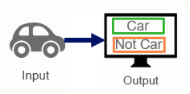

**Why the fuss about AI and deep learning?**

*July 2021*

Unless you were living under a rock, you would have come across a lot of media coverage centered around Artificial Intelligence, Machine Learning, and Deep Learning over the past decade. Companies like OpenAI, Google, Meta, and Tesla have leveraged AI to their advantage: 

Tesla autopilot uses Deep Learning to successfully navigate roads

You might ask, computers have been around for a very long time, what’s up with all the fuss about artificial intelligence and in particular machine learning and deep learning in the recent past? So much so, that the media has started to paint doomsday scenarios that AI may one day take over from humans as the dominant form of intelligence on Earth!

Some of the headlines in the past decade related to AI takeover

In reality, we are a fair way away from such a scenario. A statement by Andrew Ng concerning the above provides a more realistic picture:

*Fearing a rise of killer robots is like worrying about overpopulation on Mars.*
Andrew Ng – CEO Landing AI, Adjust Professor at Stanford University

Unfortunately, you won’t be able to get to order any goodies online on the Red Planet anytime soon!

In other words, we haven’t even solved some of the fundamental problems in AI and that’s why focusing on a potential AI takeover is the wrong problem to focus on.

It does still beg the question, why the fuss about deep learning? After all, a quick search on Google Trends, for the term “deep learning” shows an exponential increase in interest in the past decade:

To answer why, we have to first understand some of the historical limitations of machine learning. The TLDR for why deep learning is so hot right now is that *Machine Learning requires Feature Engineering while Deep Learning does not.*

Let’s dig deeper to understand what we mean by that statement. Let’s assume you have heard all the hype about artificial intelligence and you decide that it’s time you start your own company that sells self-driving cars. As the founder, you get started with figuring out how to build an effective algorithm for safely navigating the car on the road. Such a learning algorithm should at least be able to identify when there is another car on the road. How would we do that?

Let’s say you installed a camera on the front bumper and used it to capture a 1-minute video, similar to the one from your competitor Tesla. Because you are a thoughtful engineer, you chop the video into 10ms segments each of which you can now treat as an image. You now have 600 images from the 1 minute video and your task is to make the computer output whether there is a car in the image or not. The task seems simple enough:
32

Imagine, you are the founder of a startup building a learning algorithm for a self-driving car. An important task would be to identify other cars in the environment. *Given an image identify if it contains a car or not.*

Assume you know nothing about learning algorithms but you can do a bit of coding, after all you are a founder of a tech startup. You visually inspect your 600 images and manually label each as “1” if it contains a car and “0” if it does not contain a car. Now you decide to write a program to output car/no car depending on the input. So you write a simple program:

If Data == 1
     print('Car')
else
     print('No car')
end
You show the above piece of code to your co-founder, Bob, who recently read a blog about [what machine learning is](ml.md). Bob shakes his head.

Bob is not convinced

Bob points out that what you wrote looks like a traditional program, i.e. it’s a hard-coded set of instructions. The data you gave to the computer consisted of 1s and 0s and you instructed the computer to print the correct answer and that, he argues, looks a lot like the traditional programming described in the blog:

If the input data took the form of a binary switch, 1 when there is a car and 0 when there isn’t, then we wouldn’t even need a machine learning algorithm. A hard-coded set of instructions would do just fine.

Secondly, Bob argues that since you did the job of labeling images as a car or no car and simply provided the labels (0 or 1) to the computer without the raw image data, you didn’t give the computer the chance to learn anything. You agree with Bob and ask him for help. Based on his knowledge, he draws the following:

You note that Bob has inverted the relationship between output and program and is now supplying the raw image data as input to the computer. Bob says that if the machine can learn such a program then this program can be deployed in a self-driving car to predict cars in new images that the camera collects! That’s true, you say…

Bob’s right!

But you point out to Bob that the raw data takes the form of an RGB image with many different pixels. Some of the pixels have something to do with a car, while others do not. Any single pixel, on its own, doesn’t tell me anything about a car anyway, you argue. How would I teach the computer to find a car in the image by looking at a bunch of pixels?

Bob is as clueless as you are.

All cars should have tires, windows, and number plates, Bob says. What if we, the engineers, extract these main features of a car and ask the machine (computer) to perform classification, i.e. predict whether a car is present in the image or not using these features instead of the raw data:

You nod and realize that by providing the computer information about the high-level representation of a car (i.e. tires, windows) instead of raw pixels, you make the learning algorithm’s job easier.

Mapping the raw data to the output has historically been a difficult task for machine learning algorithms. ML algorithms have therefore often depended on mapping manually extracted features to the output instead.

In the simplest case, you can see how this might work. You, as the engineer, would identify a part of an image containing a tire. You would provide this tire feature to the computer and ask the computer to check if a tire similar to this is present in another image. Presumably, if a tire is present, the likelihood of a car being present is high. Now the computer’s job is that of a detective, it needs to look at each patch of a new image and check if it contains the tire patch:

No tire on this one!

You point out to Bob that the computer could take the pixels of the tire patch, slide it over the new image in steps multiply it with the pixels of the image, and report back the product. If the product of the pixels leads to a large value that means the tire feature is activated in the image. The computer could then sum over the pixels and report back that the car is in the image if the product of the pixels is above a certain threshold.

Extracting tire features manually from the input image data is hard work. Bob realizes that bicycles also have tires, so you might confuse a bicycle for a car using this approach as a bike would also activate the same features. But Bob thinks you are on to something. He asks if what you are doing looks something like this:

You again nod in agreement. Bob’s drawing reminds you a lot of neurons in the brain, where dendrites provide input data, the cell body performs some function (in our case product of tire features with input image followed by applying a threshold) and an axon provides the output:

You wonder if the artificial neural network you are building can learn weights (parameters) similar to synapses in the brain:

Artificial Neural Network with a single artificial neuron with learnable weights. 

So instead of supplying tire features, you ask if artificial neural networks can learn weights (i.e. parameters) by reducing the error between the desired output and predicted output. You argue that you already have the desired output for the 600 images since you labeled the image as 1 if it contains a car and 0 if it doesn’t. Why not just use that desired output to adjust the weights of our *Artificial Neural Network*? You draw another figure to illustrate the point:

Adjust artificial neural network weights by minimizing the difference between desired and predicted output

Bob likes the idea but he sees a couple of issues. He doubts if the computer can learn high-level representations like tires and windows from just the raw pixels directly. He wonders if you could use many neurons, stacked one after the other, instead of just one neuron to make the task easier for the machine.

You get the main idea but are not sure how stacking the neurons one after another in layers such that one neuron’s output is received as the next neuron’s input can lead to the machine’s learning task becoming easier. Bob thinks that the weights of the earlier neurons will learn lower-level features (like edges) while weights of later neurons will learn object parts (e.g. tires) automatically using the information provided by earlier neurons. You stare back cluelessly at Bob and he tries to help out with the following figure:

You finally get what Bob is doing. The question Bob poses is this: could the computer automatically learn higher-level features (such as the presence of tires) from simpler representations (e.g. edges corresponding to a sudden change of intensity in the image) which in turn are generated from the raw data? You aren’t convinced with the details just yet, but you see where Bob is going with this. Bob draws another figure:

Bob says that many neurons stacked in layers one after another can automatically learn the representation as well as the mapping from the representation to the output. He calls this *Deep Learning*.

Bob says that many neurons stacked in layers one after another can automatically learn the representation as well as the mapping from the representation to the output. He calls this Deep Learning and points out that as opposed to machine learning, which requires a human to perform the feature extraction, this learning approach is completely automatic since the machine learns the representation (i.e. features) *on its own*.

You note that the input is again the raw image. If you understand it correctly, Bob is suggesting we ask the computer to perform end-to-end learning. The Deep Learning algorithm would perform representation learning (i.e. learn salient features like tires from simpler features like edges) as well as map the representations to the output. The human would not be required at all.

*Deep Learning enables end-to-end learning.*

But you also realize that to do what Bob is suggesting, you would need a lot of data and sufficient computational power since the learning algorithm has to learn the representation itself as well:

Bob agrees and gives the analogy where the computing power (CPU, GPU, TPU) is the engine of a rocket and the input data is its fuel. You need a combination of both to thrust the rocket into space, i.e. to enable Deep Learning

Bob uses the analogy where the computational power is the engine in a rocket and the input data is the fuel. You need a combination of both to thrust the rocket into space, i.e. to enable Deep Learning

So Bob says that training artificial neural networks would only make sense if you have a lot of data, otherwise machine learning algorithms that require feature extraction may just do better. He makes another plot:

Bob thinks that large Neural Networks having many layers of neurons can continue to learn with increasing data while other learning algorithms’ performance tends to stall as the representation itself is a bottleneck.

You understand what Bob means and try to put his Deep Learning idea within the context of Artificial Intelligence, Machine Learning, and Representation Learning:

You realize that the first program you wrote for identifying a car could be considered as a simple AI algorithm:

A rule-based system such as the above may be considered as a very simple form of AI

The idea of using a tire as a feature and asking the computer to map the tire feature to the car would come under *classical machine learning*:

Finally, the idea of using multiple neurons stacked in many layers, where the multiple layers through automatic representation learning/feature extraction enable End-to-End Learning without human intervention, would be considered Deep Learning:

You realize that by using Deep Learning, given enough data and computing power, you could tackle all kinds of problems, without requiring any human expertise for feature extraction. e.g. without needing medical doctors to identify portions of a brain MRI image to which the computer should pay attention when performing a diagnosis.

And that’s why Bob, you and the rest of the world think that Deep Learning isn’t just hype but is in fact here to stay. And that’s why you are so confident about launching your own startup into orbit using Deep Learning!

Your self-driving car startup launches into orbit courtesy Deep Learning. 

*Take me [home](https://sameeurrehman.com/)* 