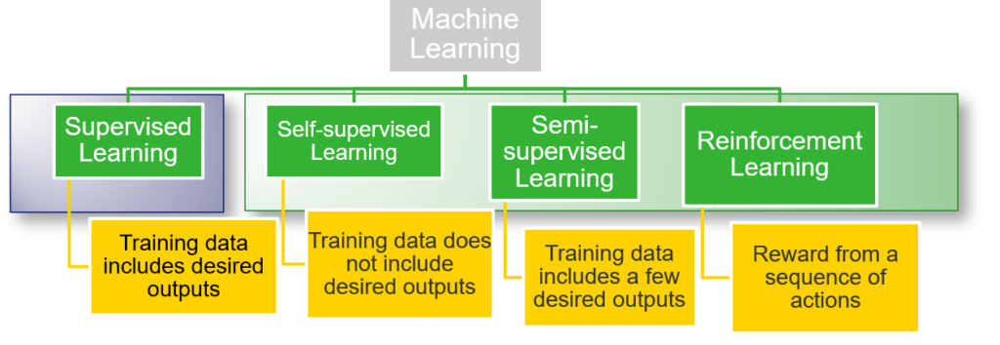

What are the different types of machine learning algorithms?

So we know [what Machine Learning is](ml.md). But what are the different ways in which machines learn?

There are four ways in which machines learn: **Supervised Learning, Semi-supervised Learning, Self-supervised learning, and Reinforcement Learning**. 

1. In the case of supervised learning, the learning engine has access to data (e.g. image of a cat) and the desired output (e.g. label, binary digit 1, indicating the presence of a cat).
2. In self-supervised learning, the learning engine has access to data (e.g. image of a cat) but NOT to the desired output (e.g. label, binary digit 1, indicating presence of a cat). Self-supervised learning is also sometimes referred to as unsupervised learning.
3. Semi-supervised learning is a combination of supervised learning and self-supervised learning. So in this case, only some parts of the data are labeled. As an example, maybe 10% of cats/non-cat images are labeled while the rest are not.
4. Reinforcement learning is a completely different beast. It assumes that an agent (e.g. a robot) is in an environment (e.g. a maze). When the agent performs a certain action, e.g. move one step forward, it is provided a reward depending on whether that action helps it to get closer or not to complete its task (e.g. get out of the maze).

Below we see concrete examples for each of the four types.

On the far left, we see an example of supervised learning, where the learning algorithm is tasked with learning the decision boundary between the green circles and red triangles.

A clustering example is shown for self-supervised learning. Here the squares need to be divided into 3 distinct portions depending on their relative distance in the two-dimensional domain spanned by x1 and x2.

For semi-supervised learning, the task is the same as the one shown for supervised learning, but in this case, some of the data is not labeled (i.e. the learning engine does not have access to whether the labels are a green circle or a red triangle).

Finally, on the far right, we see an example of reinforcement learning, where an agent (e.g. a robot) needs to navigate through an environment (e.g. a maze) by performing actions and updating its state based on the relative reward it receives.

A well trained reinforcement learning algorithm!

In industry, supervised learning is responsible for most of the economic value generated so far. But creating a dataset for supervised learning is also particularly expensive in terms of manpower, as a human being has to go through the process of labeling the data. Also, remember that while it’s easy for just about any person to label images as cat/non-cat, often datasets require expert input, e.g. labeling a dataset of radiology images requires a radiologist or sometimes even a team of radiologists and a radiologist’s time is expensive!

That’s why the machine learning research community, as a whole, is trying to leverage the power of the other three learning strategies, particularly self-supervised learning, to training learning algorithms.
